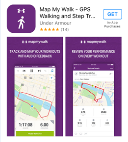

# #BerlinDataRace

* TOC
{:toc}

## What is it?

The #Berlindatarace seeks to disrupt how people share their lived experiences within academic conferences by cultivating new and interactive understandings of participant interactions, digital technologies and places.  We propose an innovative engagement session that can enhance and enrich scholars AoIR attendance through a real-time digital application where participants experience the conference host city Berlin, through a hybrid of digital and physical practices. This new engagement with AoIR takes a form of a data scavenger hunt that will not only take participants to iconic and hidden places around Berlin, but at the same time facilitates teamwork and fosters greater networking collaborations amongst AoIR internet researchers.

People get involved in the sub-culture of academic conferences through ‘material participation’ (NOTE:  Marres, N. (2012). Material Participation: Technology, the Environment and Everyday Publics. Palgrave Macmillan.)— we produce and share personal media representations of our engagements with issues and events related to AoIR via everyday social media use. Since camera phone photography and mobile apps have become embedded in the flow of everyday life (NOTE:  Pink, S., & Hjorth, L. (2012). Emplaced cartographies: Reconceptualising camera phone practices in an age of locative media. Media International Australia, 145, 145-155), these digital technologies change the way we experience our surroundings. They can be particularly useful for visiting new places, since they help us to create and archive digital memories (NOTE:  Frith, J., & Kalin, J. (2016). Here, I used to be: Mobile media and practices of place-based digital memory. Space and Culture, 19(1), 43-55. ). Route tracking apps can fortify memories of movement through space while check-in apps allow us to pin memories to a specific location. As Internet researchers, participants using mobile technologies can produce shared experiences that can help us to better understand people and places (NOTE:  Pink, S. (2008). An urban tour: The sensory sociality of ethnographic place-making. Ethnography, 9(2), 175-196.) and the interactions among them.

## How does it work?

**Conference-long event**: anyone can join in by tweeting using #belindatarace during the previous days of the experimental session. Follow us at @berlindatarace to stay tuned about the missions that will give your team extra points. More information will be available just before the conference.

**Session-specific event**: only open on 7 October, 4-6pm, focused on area around conference venue. Both events count towards the final scores

**Winner announced at AGM on 8 October**

We propose a session in which participants will share their AoiR experiences by forming teams and exploring Berlin through a mobile app.  The idea is to use the ‘GooseChase’[1] app that describes itself as ‘a scavenger hunt for the masses that is suitable for conferences, team building, universities and education.’ We custom design a Berlin GooseChase game that lists up to 100 missions for participants to complete. The main goal is for teams to complete as many missions as possible within the allocated time, typically around 1.5 hours. The missions stem from a mix of Berlin’s historical, architectural, artistic or pop culture themes that have a name, a description and can be a short answer, geo-location check in or a camera phone uploaded photo that attracts a pre-determined point value. By participants tweeting their experiences, taking pictures, uploading videos, using Instagram and geo-locating their missions, their collective aim is to obtain as many points as possible. The more difficult the mission, the higher the point value. The team with the most accumulated points wins the #Berlindatarace.

At the beginning of the session overview, participants download the ‘GooseChase’ app and register under their team’s name and password on their android or IOS mobile device. Participants then select a mission from the list and follow the instructions. Team leaders can track their team’s activity in real-time and view their team’s position on the app’s leader board. In addition to the points automatically awarded when participants complete missions through the app, participants can gain extra bonus points by mapping their route or posting #Berlindatarace Instagram photos or Tweets along the way, always remembering to include the hashtag of their teams for a better tracking of their activities. AoIR participants can increase their overall mission scores by strategically using #Berlindatarace on twitter, Instagram and MapMyWalk.[1]

The final (and mandatory) mission takes place at a Berlin café or pub to facilitate networking and social interactions among the participants. Through play we foster different interactions than ‘at work’ and this experimental session can help participants to connect with people that otherwise would be more difficult to do so.

After completion of the #Berlindatarace game within the set timeframe, facilitators review team missions by analysing each individual team’s collective data. Facilitators report back to the conference cohort with a slideshow of how AoIR participant teams experienced Berlin through their photos, geo visual data and #Berlindatarace twitter and Instagram activity. At the end of the slideshow, facilitators announce the winning team with the most points and award them with the #Berlindatarace prize.

## Teams

5 **Teams will be allocated at the conference**

## Rules

1. Use the data race hashtag -- #**berlindatarace** -- on Twitter to be eligible for the social media points

1. Every conference participant will be allocated randomly to one of five teams at the beginning of the conference. Each of your social media activities using #berlindatarace will count towards your team’s success!

2. At the session-specific event, you will meet (some of) your fellow team members in person and work as a team for the remainder of the session using the GooseChase app.

3. At the start of the session, teams will be given their login details for completing the #berlindatarace. Each team will be asked to choose a team champion, who will be responsible for entering your team’s answers. Each team will only use one mobile phone for this.

4. You have a limited time to earn as many points as possible - think strategically which challenges to tackle. Also remember, as you only use one account, your team needs to stay together during the session time.

5. Each team needs to take and upload a team photo at the beginning and end of the session.

6. Additional points can be earned for tracking your team’s journey during the session with MapMyWalk. You can use a second phone for MapMyWalk.

7. Team points earned during the session will be added to social media points previously earned to determine the winning team. Special points can be earned in certain categories, which will be announced during the conference and at the beginning of the session (i.e. team with the most steps, biggest team at session, etc.).

8. Winners will be announced on Saturday afternoon at the AGM.

9. Have fun!

## Getting ready

Install and sign up for: Goose Chase; MapMyWalk

### Goose Chase:

1. Download the app  

	

2. You can familiarise yourself with GooseChase by signing up using Facebook or email; however, each team will be given a unique username and password at the start of the session for completing the #berlindatarace.

3. Details for joining the game will be provided at the start of the session.

### Map My Walk

1. Download the app

2. Join Now - sign up using Facebook or email

3. Start tracking your movements when the #berlindatarace session begins!

### Area covered (feel free to add more locations/points of interest, I’ve started it off!):

[https://drive.google.com/open?id=1dEd8Zi6_xeV07oe99EzFYaz7g-Y&usp=sharing](https://drive.google.com/open?id=1dEd8Zi6_xeV07oe99EzFYaz7g-Y&usp=sharing)

## Recommendations for the event

Wear: comfortable clothes and shoes

Bring: water to drink, an umbrella, a hat, sunscreen, one mobile* device per team

* Think about data-limits on your device before using it. It may be preferable to use a device belonging to a team-member with a German phone / plan / data-cap.

## Organiser details

Ariadna Matamoros Fernandez––[ariadna.matamorosfernandez@qut.edu.au](mailto:ariadna.matamorosfernandez@qut.edu.au)

Rachel Hews—[rachel.hews@qut.edu.au](mailto:rachel.hews@qut.edu.au)

Katherina Drinkuth - k.drinkuth@qut.edu.au

Pic logo credit: [https://www.flickr.com/photos/72058121@N00/30651841/](https://www.flickr.com/photos/72058121@N00/30651841/)

(we can change it)
